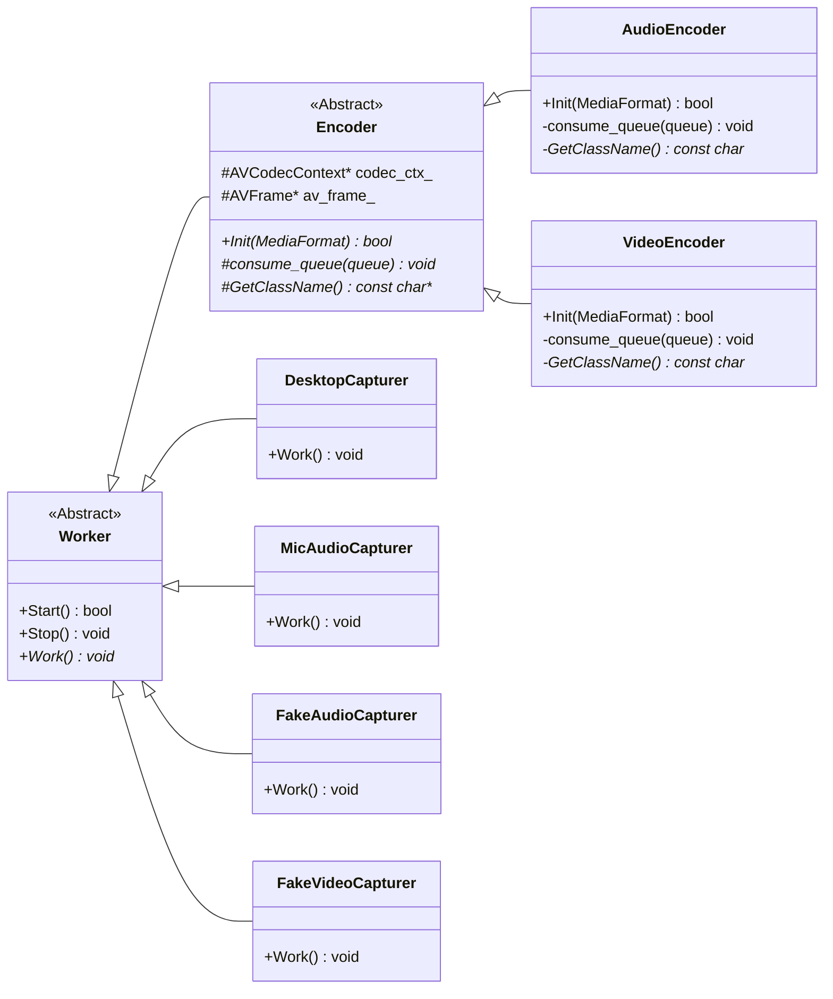
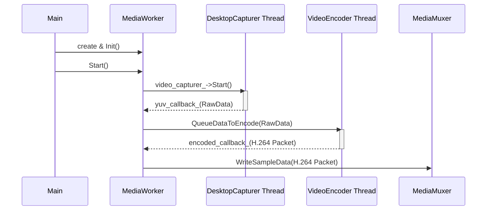
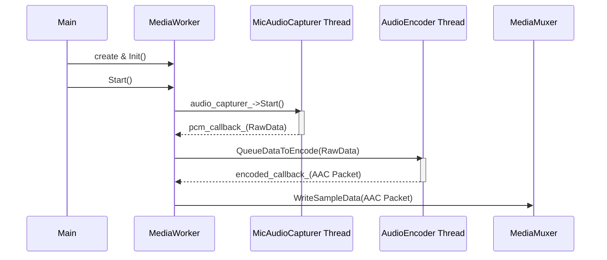

# Worker Class Hierarchy (Unified)

This document outlines the class hierarchy based on a unified architecture where all asynchronous components inherit from `Worker`.

## Inheriting Classes

In this unified design, all asynchronous components—both **Capturers** and **Encoders**—inherit from `Worker` to gain a common threading capability.

### Capturers
* `DesktopCapturer`
* `MicAudioCapturer`
* `FakeAudioCapturer`
* `FakeVideoCapturer`

### Encoders
* `Encoder` (as an abstract base for all encoders)
* `AudioEncoder` (inherits from `Encoder`)
* `VideoEncoder` (inherits from `Encoder`)

## Design Rationale

This unified design, where both capturers and encoders are `Worker`s, provides several key benefits:

* **Code Reusability**: Eliminates redundant thread management code that previously existed in the `Encoder` class.
* **Unified Interface**: All asynchronous components share the `Start()`, `Stop()`, and `Work()` methods, creating a consistent and predictable architecture.
* **Simplified Control**: Allows the main application to manage all capturers and encoders polymorphically, simplifying overall control flow.
## Concept
### Producer-Consumer

## UML Diagram
The updated diagram now shows `Encoder` as a direct child of `Worker`, unifying the two previous parallel hierarchies.

### Classes

### Sequence:
Video pipe:

Audio pipe:

